# Sync Console Guide

The console is where you create and run replication and backup tasks. Monitoring lives in Grafana: sync exports Prometheus metrics, and the **Sync Replication** dashboard reads them.

## Sign in
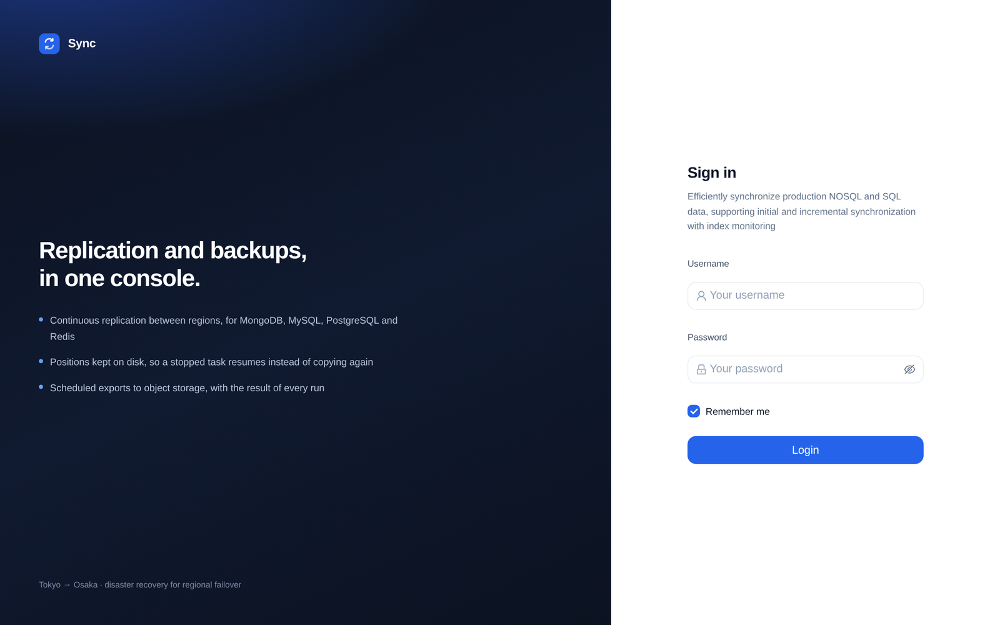

- **Admin account.** On a new control database, the first start creates `admin` with the password in `SYNC_ADMIN_PASSWORD`. Without that variable nobody can sign in until it is set and sync restarts. The variable is read only while there are no accounts. See [The first sign-in](README.md#the-first-sign-in).
- **Google account.** Available once Google login is enabled under **Settings → Authentication**.

## Sync tasks
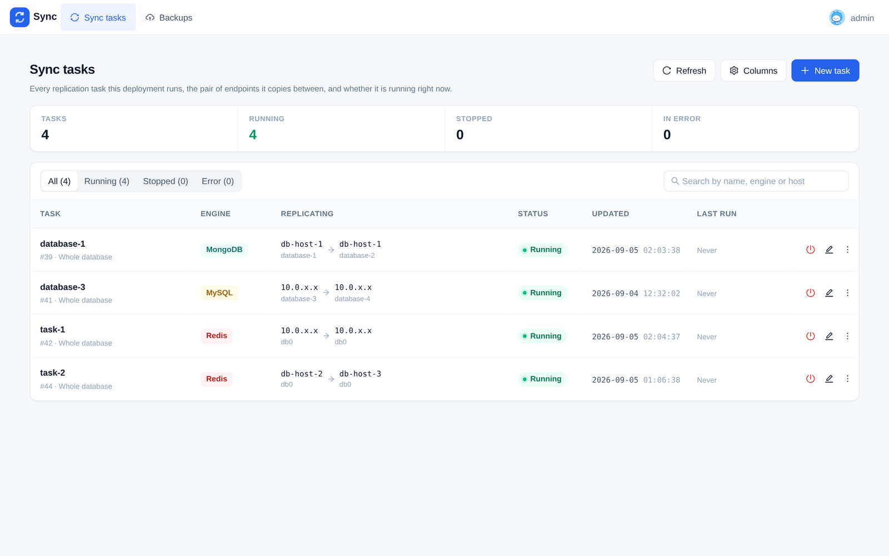

- The page counts tasks by state and lists each one with its engine, the endpoints it replicates between, its status and when it last changed.
- Filter by **All**, **Running**, **Stopped** or **Error**, or search by name, engine or host.
- Start or stop a task, edit it, or open its menu from the icons at the end of its row. Stopping a task keeps its position; starting it again resumes from there.
- Positions are stored in the target database (`_sync_checkpoint`), not on the syncer's disk, so a task resumes after the syncer is moved or rebuilt.

### Add a task
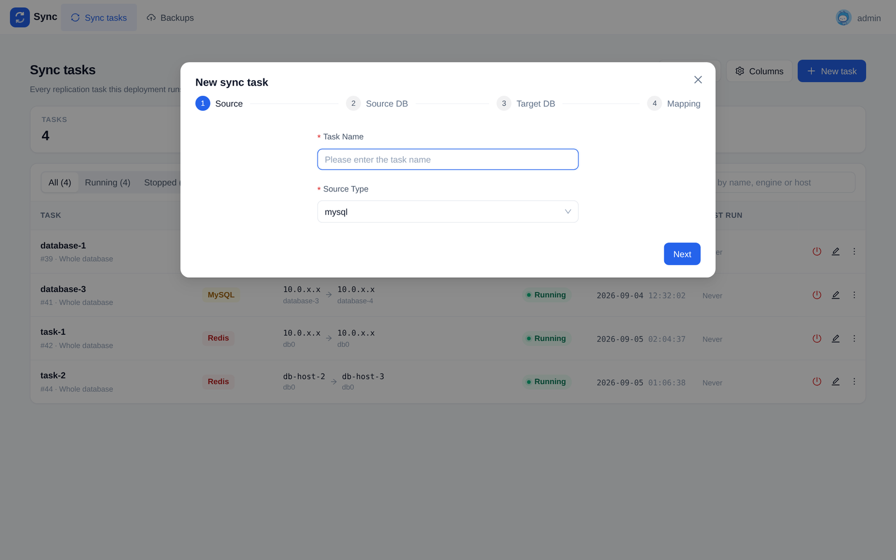

Click **New task** and go through four steps:

1. **Source.** A task name and the source type: MySQL, MariaDB, PostgreSQL, MongoDB or Redis. PostgreSQL also asks for its replication slot, plugin and publication.
2. **Source DB.** Host, port, user, password and database.
3. **Target DB.** The same for the target.
4. **Mapping.** Leave it empty to replicate the whole database, or pick tables or collections and give them target names. Fields can be masked or encrypted on their way to the target.

## Backups
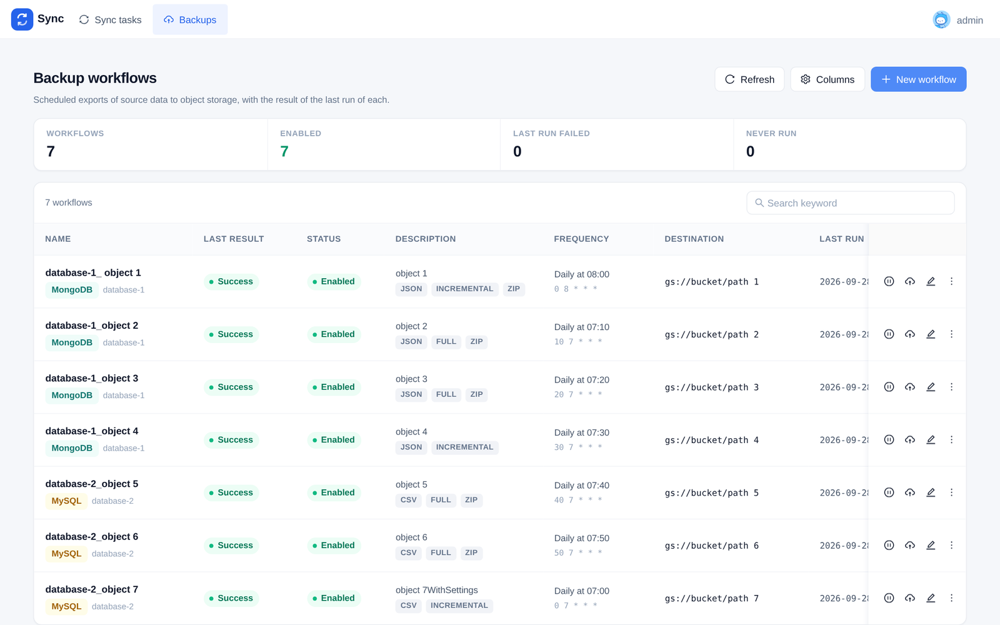

- Click **New workflow** to schedule an export of MongoDB, MySQL or PostgreSQL to object storage.
- Choose the format (BSON, JSON or CSV), full or incremental, optional query filters, the schedule and a GCS destination.
- The list shows each workflow's last result, schedule and destination, with counts of enabled workflows and failed runs at the top.

## Settings

Open **Settings** from the menu under your name in the top-right corner.

### Authentication
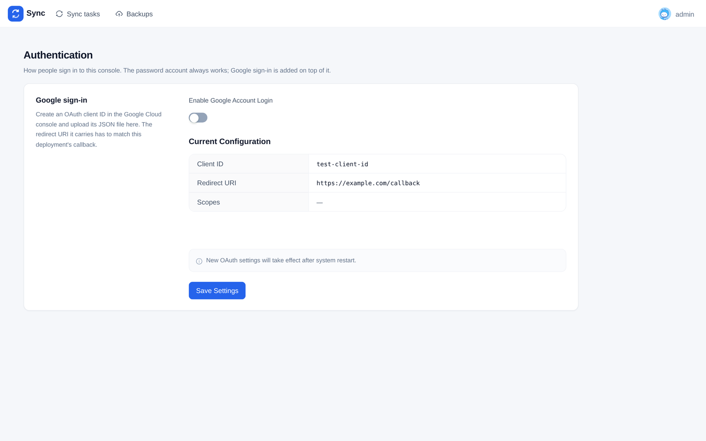

- The password account always works; Google sign-in is added on top of it.
- Enable or disable Google login, and upload the OAuth client configuration file (JSON). The page shows the client ID and redirect URI in use. New OAuth settings take effect after sync restarts.

### Replication
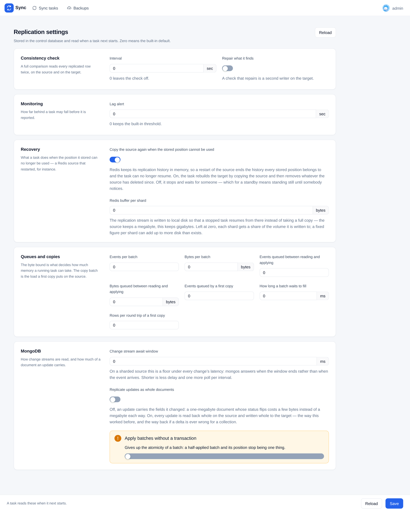

Settings an operator can change without rebuilding the image. They are stored in the control database, apply to every task, and are read when a task next starts. Zero means the built-in default. An environment variable set on the deployment overrides the stored value.

| Group | Settings |
|---|---|
| Consistency check | interval between source and target comparisons, and whether to repair what it finds |
| Monitoring | lag alert threshold |
| Recovery | copy the source again when the stored position cannot be used; Redis buffer size per shard |
| Queues and copies | events and bytes per batch, events and bytes queued between reading and applying, events queued by a first copy, how long a batch waits to fill, rows per round trip of a first copy |
| MongoDB | change stream await window, replicate updates as whole documents, apply batches without a transaction |

## Monitoring in Grafana

The **Sync Replication** dashboard (`uid: sync-replication`) has one row per concern. Prometheus scrapes sync through the `sync-headless` service; see [deploy/README.md](deploy/README.md). The screenshots below are from staging, last 24 hours.

### Overview
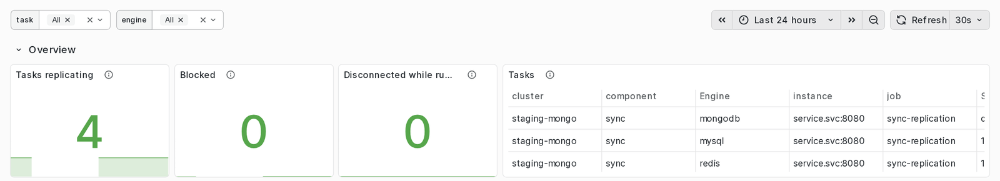

Tasks replicating, blocked and disconnected, with one line per task.

### Retention and safety
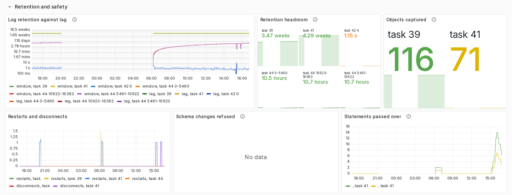

How much of the source's log is left against the current lag, restarts and disconnects, schema changes the task refused, and statements it passed over.

### Replication
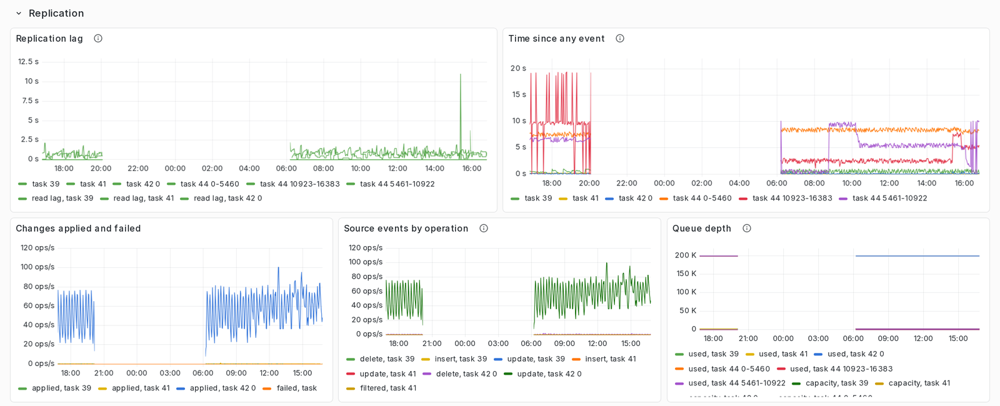

Replication lag, time since the last event, changes applied and failed, source events by operation, and queue depth.

### Buffer and disk
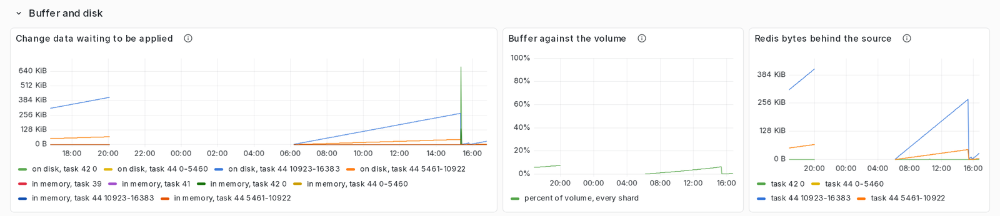

Change data waiting to be applied, the buffer against its volume, and how many bytes a Redis task is behind its source.

### Backups
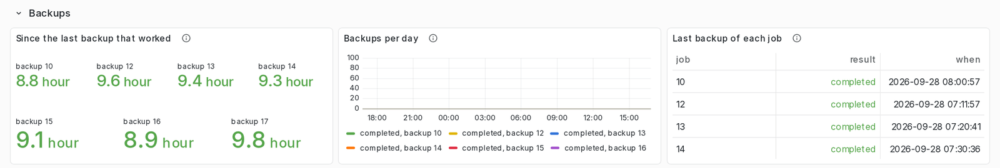

Time since each job's last successful backup, backups per day, and the last run of every job.

### Row counts
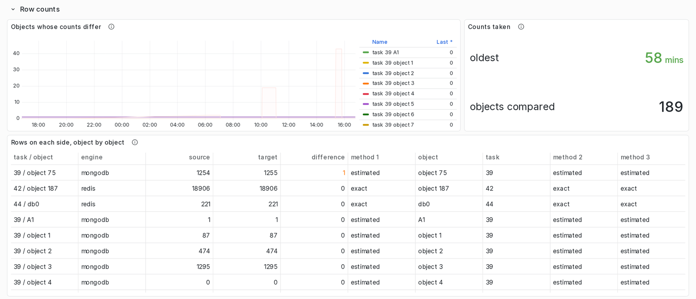

Objects whose counts differ between source and target, and the rows on each side, object by object.

### Batch efficiency
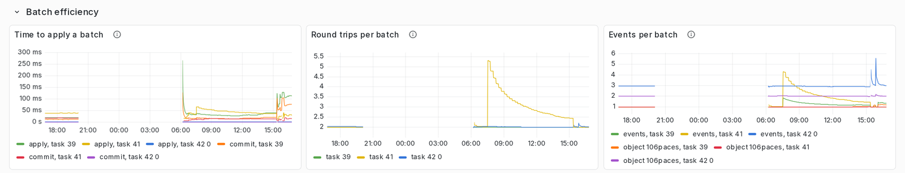

Time to apply a batch, round trips per batch, and events per batch. Collapsed by default.

### Initial copy
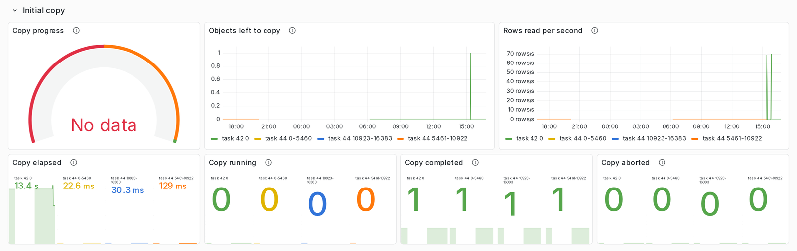

Copy progress, objects left, rows read per second and elapsed time while a task copies its source. Collapsed by default.
